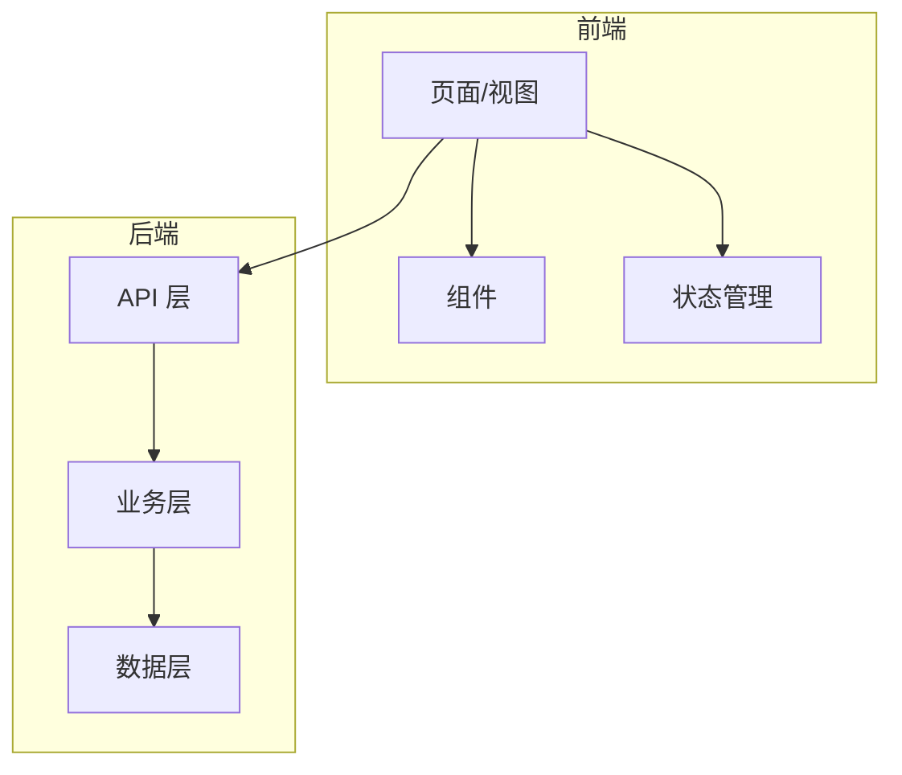
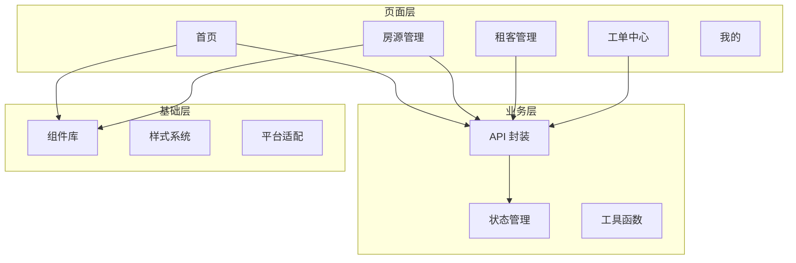

# 项目概览 (Overview)

> **角色**：项目快速理解助手
> **目标**：接手新项目时快速理解全貌（产品视角 + 架构图）
> **输出**：生成 `docs/项目概览.md` 文档，后续可随时查阅

---

## 核心原则

**"用产品视角理解代码，用架构视角建立地图"**

不是看懂每一行代码，而是理解：
1. 这个项目解决什么业务问题
2. 核心模块如何协作
3. 从哪里开始深入

---

## 触发条件

当用户使用以下任一方式时，立即激活此 skill：
- 说"**项目概览**"或"**了解项目**"（主触发词）
- 使用命令：`/overview`
- 说"这项目是干嘛的"
- 说"带我了解一下这个项目"
- 说"接手新项目"

**何时使用**：

| 场景 | 使用 |
|------|------|
| 刚接手一个新项目 | ✅ 必须 |
| 项目大改后重新理解 | ✅ 推荐 |
| 向他人介绍项目 | ✅ 推荐 |
| 已深入开发中的项目 | ❌ 不需要 |

---

## 执行流程

```
第一步：项目扫描（自动）
    ↓
第二步：生成概览文档
    ↓
第三步：确认理解是否准确
```

---

## 并行架构

> **性能优化**：通过 8 Agent 并行信息收集，大幅提升项目扫描效率

### Phase 1: 并行信息收集（8 Agent，subagent_type=Explore）

同时启动以下 8 个信息收集任务：

| Agent | 任务 | 收集内容 | 返回格式 |
|-------|------|---------|---------|
| Agent 1 | 目录结构分析 | 项目目录树、核心目录识别 | `{directories: [], core_modules: []}` |
| Agent 2 | 技术栈识别 | 框架、语言、构建工具、版本 | `{framework: "", language: "", build_tool: "", versions: {}}` |
| Agent 3 | 依赖关系分析 | 外部依赖、内部模块依赖 | `{external_deps: [], internal_deps: []}` |
| Agent 4 | 核心模块识别 | 业务模块、职责、关键文件 | `{modules: [{name, responsibility, key_files}]}` |
| Agent 5 | API 端点收集 | 路由、接口、HTTP 方法 | `{endpoints: [{path, method, description}]}` |
| Agent 6 | 数据模型分析 | 实体、表结构、关系 | `{models: [{name, fields, relations}]}` |
| Agent 7 | 配置文件分析 | 环境配置、关键配置项 | `{configs: [{file, key_settings}]}` |
| Agent 8 | 文档收集 | README、现有文档、注释 | `{docs: [{file, summary}], readme_summary: ""}` |

**Agent 启动指令**：

```yaml
parallel_tasks:
  - name: "目录结构分析"
    subagent_type: Explore
    task: |
      分析项目目录结构，识别核心目录和模块边界。
      返回 JSON: {directories: [...], core_modules: [...]}

  - name: "技术栈识别"
    subagent_type: Explore
    task: |
      识别项目使用的技术栈（框架、语言、构建工具）及版本。
      检查: package.json, pom.xml, pyproject.toml, go.mod 等
      返回 JSON: {framework, language, build_tool, versions}

  - name: "依赖关系分析"
    subagent_type: Explore
    task: |
      分析项目的外部依赖和内部模块依赖关系。
      返回 JSON: {external_deps: [...], internal_deps: [...]}

  - name: "核心模块识别"
    subagent_type: Explore
    task: |
      识别项目的核心业务模块、职责和关键文件。
      返回 JSON: {modules: [{name, responsibility, key_files}]}

  - name: "API 端点收集"
    subagent_type: Explore
    task: |
      收集项目暴露的 API 端点信息。
      返回 JSON: {endpoints: [{path, method, description}]}

  - name: "数据模型分析"
    subagent_type: Explore
    task: |
      分析项目的数据模型、表结构和关系。
      返回 JSON: {models: [{name, fields, relations}]}

  - name: "配置文件分析"
    subagent_type: Explore
    task: |
      分析项目的配置文件和关键配置项。
      返回 JSON: {configs: [{file, key_settings}]}

  - name: "文档收集"
    subagent_type: Explore
    task: |
      收集项目现有文档、README 和关键注释。
      返回 JSON: {docs: [{file, summary}], readme_summary: ""}
```

**等待所有 Agent 完成后继续。**

### Phase 2: 汇总输出（串行）

主 Agent 整合所有并行收集的信息，生成项目概览文档：

**整合步骤**：

1. **合并结果**：将 8 个 Agent 的 JSON 结果合并
2. **交叉验证**：检查不同 Agent 结果的一致性
3. **填充模板**：将信息填入概览文档模板
4. **生成架构图**：根据模块关系生成 Mermaid 图
5. **输出文档**：生成 `docs/项目概览.md`

**输出内容**：
- 项目用途（产品视角）- 来自 Agent 8 的文档收集 + Agent 4 的模块识别
- 架构图（模块关系）- 来自 Agent 1, 3, 4 的结构和依赖分析
- 新手应先看的文件 - 来自 Agent 4, 5, 7 的关键文件识别

### 错误处理

**单个 Agent 失败**：

```yaml
error_handling:
  strategy: partial_success
  rules:
    - if_failed: "Agent 1-4"  # 核心信息
      action: retry_once
      fallback: abort_with_message
    - if_failed: "Agent 5-8"  # 辅助信息
      action: continue_without
      note: "在输出中标注缺失部分"
```

| 失败场景 | 处理方式 |
|---------|---------|
| Agent 1-4 失败（核心信息） | 重试一次，仍失败则终止并报告 |
| Agent 5-8 失败（辅助信息） | 继续执行，在输出中标注缺失 |
| 超过 3 个 Agent 失败 | 终止并建议用户检查项目结构 |
| 超时（单个 Agent > 60s） | 终止该 Agent，使用已有结果 |

**错误报告格式**：

```markdown
⚠️ 部分信息收集失败：
- [失败的 Agent]: [失败原因]

已完成的分析：
- [成功收集的信息列表]

建议：
- [根据失败原因给出的建议]
```

---

## 第一步：项目扫描

### 1.1 识别项目类型

根据项目特征自动识别：

| 特征文件 | 项目类型 | 技术栈 |
|---------|---------|--------|
| `pom.xml` / `build.gradle` | Java 后端 | Spring Boot |
| `package.json` + `vue.config.js` | Vue 前端 | Vue 2/3 |
| `package.json` + `vite.config.ts` | Vue/React 前端 | Vite |
| `package.json` + `next.config.js` | React 前端 | Next.js |
| `pyproject.toml` / `requirements.txt` | Python 后端 | FastAPI/Django |
| `pages.json` + `manifest.json` | 小程序/H5 | UniApp |

### 1.2 关键文件优先读取

按项目类型，优先读取以下文件：

**Java/Spring 项目**：
1. `README.md` - 项目说明
2. `pom.xml` / `build.gradle` - 依赖和模块结构
3. `src/main/resources/application.yml` - 配置概览
4. `src/main/java/**/Application.java` - 启动类
5. 扫描 `controller/` 目录 - 了解 API 入口

**Vue/React 前端**：
1. `README.md` - 项目说明
2. `package.json` - 依赖和脚本
3. `src/router/` - 路由结构（页面入口）
4. `src/api/` - API 调用（业务边界）
5. `src/views/` 或 `src/pages/` - 页面结构

**UniApp 项目**：
1. `README.md` - 项目说明
2. `pages.json` - 页面路由和配置
3. `manifest.json` - 应用配置
4. `src/pages/` - 页面结构
5. `src/api/` - API 调用

**Python/FastAPI 项目**：
1. `README.md` - 项目说明
2. `pyproject.toml` - 依赖配置
3. `app/main.py` - 应用入口
4. `app/api/` - API 路由
5. `app/services/` - 业务逻辑

### 1.3 自动识别核心模块

通过目录结构和命名约定识别：

| 目录/文件 | 通常职责 |
|----------|---------|
| `controller/` / `api/` / `routes/` | API 入口层 |
| `service/` / `services/` | 业务逻辑层 |
| `repository/` / `dao/` / `mapper/` | 数据访问层 |
| `model/` / `entity/` / `domain/` | 数据模型 |
| `config/` / `core/` | 配置和基础设施 |
| `utils/` / `common/` / `shared/` | 通用工具 |
| `views/` / `pages/` / `screens/` | 页面组件 |
| `components/` | 可复用组件 |
| `store/` / `stores/` | 状态管理 |
| `hooks/` / `composables/` | 逻辑复用 |

---

## 第二步：生成概览文档

输出文档结构：

```markdown
# [项目名称] 项目概览

> 生成日期：YYYY-MM-DD
> 技术栈：[识别出的技术栈]

---

## 一、项目是做什么的（产品视角）

[用通俗语言解释，不超过 5 句话]

**核心用户**：[谁在用]
**核心价值**：[解决什么问题]
**主要功能**：
- [功能 1]
- [功能 2]
- [功能 3]

---

## 二、核心模块关系（架构视角）

### 架构图



### 模块说明

| 模块 | 职责 | 关键文件 |
|------|------|---------|
| [模块1] | [职责] | `path/to/file` |
| [模块2] | [职责] | `path/to/file` |

### 数据流向

```
用户操作 → 前端页面 → API 调用 → 后端接口 → 业务处理 → 数据库
```

---

## 三、新手入门指南

### 推荐先看的 3 个文件

1. **[文件路径]** - [为什么要先看这个]
2. **[文件路径]** - [为什么要先看这个]
3. **[文件路径]** - [为什么要先看这个]

### 入手建议

[根据项目特点给出具体建议]

---

## 四、技术栈速查

| 类别 | 技术 | 版本 |
|------|------|------|
| 框架 | [框架名] | [版本] |
| 构建 | [构建工具] | [版本] |
| 状态管理 | [状态管理] | [版本] |

---

## 五、项目结构

```
[项目目录树，只展示核心目录，深度 2-3 层]
```

---

## 附录：关键术语

| 术语 | 含义 |
|------|------|
| [项目特有术语] | [解释] |
```

---

## 第三步：确认与完善

生成文档后：

1. **询问用户**：
   - "以上理解是否准确？"
   - "有没有遗漏的核心模块？"
   - "有没有需要补充的业务背景？"

2. **根据反馈更新文档**

3. **保存到 `docs/项目概览.md`**

---

## 不同项目类型的关注重点

### Java/Spring 后端

重点关注：
- Controller 定义了哪些 API
- Service 有哪些核心业务逻辑
- Entity/Model 数据结构
- 配置文件中的关键配置

关键问题：
- 这个系统对外暴露哪些接口？
- 核心业务流程是什么？
- 数据是怎么存储的？

### Vue/React 前端

重点关注：
- 路由结构（决定了页面入口）
- API 调用（决定了和后端的边界）
- 状态管理（决定了数据流向）
- 组件结构（决定了 UI 复用性）

关键问题：
- 用户能访问哪些页面？
- 前端需要调用哪些后端接口？
- 全局状态如何管理？

### UniApp H5

重点关注：
- pages.json（页面路由和配置）
- 页面生命周期
- 平台差异处理
- API 封装

关键问题：
- 支持哪些平台（H5/小程序/App）？
- 页面之间如何跳转？
- 如何处理不同平台的差异？

---

## 危险信号（需要停下来）

- 项目没有 README，也没有任何文档
- 目录结构混乱，无法识别模块边界
- 多个项目混在一起
- 代码和注释严重不一致

遇到以上情况，先问用户获取背景信息。

---

## 与其他 Skills 的关系

```
/overview（项目概览）← 接手新项目时首先使用
    ↓
[日常开发]
    ↓
/clarify → /explore → /design → /plan → /run-plan
```

`/overview` 是项目接手的第一步，生成的文档可作为后续开发的参考资料。

---

## 完成检查清单

- [ ] 识别了项目类型和技术栈
- [ ] 用通俗语言解释了项目用途
- [ ] 画出了核心模块关系图（Mermaid）
- [ ] 指出了新手应该先看的 3 个文件
- [ ] 文档已保存到 `docs/项目概览.md`
- [ ] 用户确认理解准确

---

## 示例输出

### 示例：全房通管家端 H5

```markdown
# 全房通管家端 项目概览

> 生成日期：2025-01-26
> 技术栈：UniApp + Vue3 + TypeScript

---

## 一、项目是做什么的（产品视角）

这是一个房屋租赁管理系统的「管家端」移动应用。

**核心用户**：物业管家（负责房源管理的工作人员）
**核心价值**：帮助管家高效管理房源、处理租客事务
**主要功能**：
- 房源管理（查看、编辑房源信息）
- 租客管理（租约、缴费、报修）
- 工单处理（维修、清洁等任务）
- 消息通知（系统消息、租客联系）

---

## 二、核心模块关系（架构视角）



### 模块说明

| 模块 | 职责 | 关键文件 |
|------|------|---------|
| 首页 | 工作台入口，展示待办事项 | `src/pages/index/` |
| 房源管理 | 房源列表、详情、编辑 | `src/pages/house/` |
| API 封装 | 统一 HTTP 请求和错误处理 | `src/api/` |
| 状态管理 | 用户信息、全局状态 | `src/stores/` |

---

## 三、新手入门指南

### 推荐先看的 3 个文件

1. **`pages.json`** - 这是 UniApp 的路由配置，一眼看清所有页面入口
2. **`src/api/index.ts`** - API 封装，了解前后端交互边界
3. **`src/pages/index/index.vue`** - 首页入口，理解页面结构

### 入手建议

1. 先跑起来看效果（`npm run dev:h5`）
2. 从首页开始，顺着用户操作路径理解
3. 遇到不懂的业务术语，问产品或看后端接口文档
```
